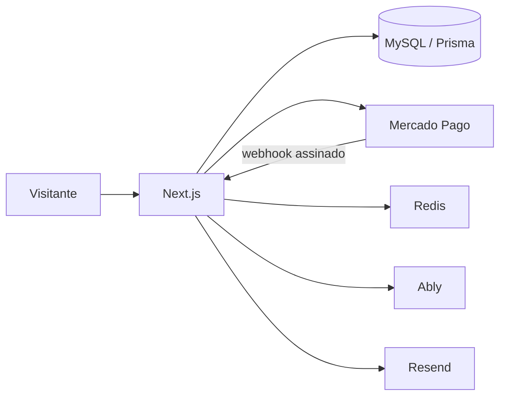

<div align="center">
  

  # Anuncio.top

  **Visibilidade à venda, posição por posição.**

  Um ranking brasileiro onde sites disputam atenção com lances públicos.<br />
  Quem oferece mais sobe. Quem está no topo recebe os primeiros olhares.

  [Acessar o site](https://anuncio.top) · [Ver as regras](https://anuncio.top/regras) · [Reportar um problema](https://anuncio.top/denunciar)
</div>

---

## O que é

O **Anuncio.top** transforma visibilidade em uma disputa simples e transparente. O anunciante cola seu link, segue para o Checkout Pro e entra no ranking depois que o Mercado Pago confirma o pagamento pelo webhook.

Não há cadastro antes da compra, integração por API ou divisão de receita. Um site que já está no ranking pode receber um novo lance e mudar de posição.

## Como funciona

1. O anunciante informa a URL do site.
2. O servidor normaliza o endereço, verifica duplicidade e calcula o próximo lance.
3. O pagamento é criado no Mercado Pago.
4. O webhook assinado confirma o pagamento.
5. O valor líquido determina a posição no ranking.

> O retorno do navegador nunca publica um anúncio. Somente a confirmação consultada e processada pelo servidor altera o ranking.

## Recursos atuais

- Ranking público ordenado pelo valor pago.
- Título, descrição e favicon extraídos do site anunciado.
- Contagem de cliques e visitas do Anuncio.top.
- Aumento de lance para endereços já publicados.
- Checkout Pro com Pix via Mercado Pago.
- Webhook idempotente para aprovação, estorno e chargeback.
- Links rastreados com redirecionamento seguro e UTM.
- Painel do anunciante por link mágico.
- Área administrativa para moderação e operações financeiras.
- Denúncias, regras, termos e política de privacidade.
- Atualizações em tempo real preparadas com Ably e Redis.

## Arquitetura



| Camada | Tecnologia |
| --- | --- |
| Aplicação | Next.js App Router, React e TypeScript |
| Persistência | MySQL com Prisma |
| Pagamentos | Mercado Pago Checkout Pro |
| Autenticação | Auth.js e links mágicos |
| E-mail | Resend |
| Cache e contadores | Upstash Redis |
| Tempo real | Ably |
| Hospedagem | Vercel |

## Rodando localmente

Requisitos: Node.js 20+ e um banco MySQL compatível.

```bash
git clone https://github.com/Cadumendonca/anuncie.top.git
cd anuncie.top
npm install
```

Copie o arquivo de exemplo e preencha apenas as integrações que pretende usar:

```bash
cp .env.example .env.local
npm run db:push
npm run dev
```

A aplicação estará disponível em `http://localhost:3000`.

Sem banco configurado, nenhum dado é persistido. Sem o token do Mercado Pago, nenhuma cobrança real é criada.

## Variáveis de ambiente

| Variável | Uso | Obrigatória em produção |
| --- | --- | :---: |
| `NEXT_PUBLIC_APP_URL` | URL pública canônica | Sim |
| `DATABASE_URL` | Conexão MySQL | Sim |
| `AUTH_SECRET` | Assinatura das sessões | Sim |
| `ADMIN_EMAILS` | E-mails com acesso administrativo | Sim |
| `AUTH_RESEND_KEY` | Envio de links mágicos | Sim |
| `EMAIL_FROM` | Remetente dos e-mails | Sim |
| `MERCADO_PAGO_ACCESS_TOKEN` | Criação e consulta de pagamentos | Sim |
| `MERCADO_PAGO_WEBHOOK_SECRET` | Validação das notificações | Sim |
| `MERCADO_PAGO_LIVE_MODE` | Alterna teste e produção | Sim |
| `ABLY_API_KEY` | Eventos em tempo real | Opcional |
| `UPSTASH_REDIS_REST_URL` | Redis via REST | Opcional |
| `UPSTASH_REDIS_REST_TOKEN` | Autenticação do Redis | Opcional |
| `CRON_SECRET` | Proteção dos jobs periódicos | Recomendado |

Consulte [`.env.example`](.env.example) para ver todas as opções e valores padrão seguros.

## Webhook do Mercado Pago

Configure a integração para enviar notificações para:

```text
https://anuncio.top/api/webhooks/mercado-pago
```

O endpoint valida a assinatura, evita o processamento duplicado e consulta o pagamento diretamente no Mercado Pago antes de atualizar qualquer posição.

## Comandos

| Comando | Descrição |
| --- | --- |
| `npm run dev` | Inicia o ambiente de desenvolvimento |
| `npm run typecheck` | Valida os tipos TypeScript |
| `npm test` | Executa os testes unitários |
| `npm run build` | Gera o Prisma Client e cria o build de produção |
| `npm run db:push` | Sincroniza o schema no banco configurado |

## Segurança

- Segredos devem existir somente nas variáveis de ambiente da hospedagem ou no `.env.local`.
- Arquivos `.env*`, certificados e chaves privadas são ignorados pelo Git; apenas `.env.example` pode ser versionado.
- Nunca use credenciais de produção em commits, issues, screenshots ou logs.
- Se uma credencial já tiver sido publicada, removê-la do arquivo não basta: revogue-a, gere outra e limpe o histórico quando necessário.

## Estado do projeto

O produto está em desenvolvimento ativo. Antes de operar pagamentos reais, valide as credenciais comerciais, o webhook, os fluxos de estorno e os documentos jurídicos no ambiente de produção.

---

<div align="center">
  Feito para colocar bons produtos diante de mais pessoas.
</div>
